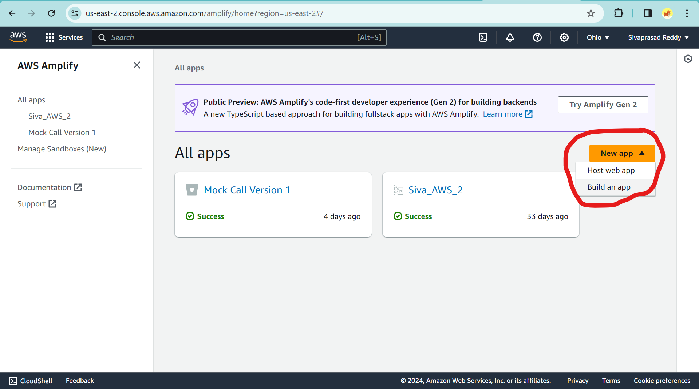
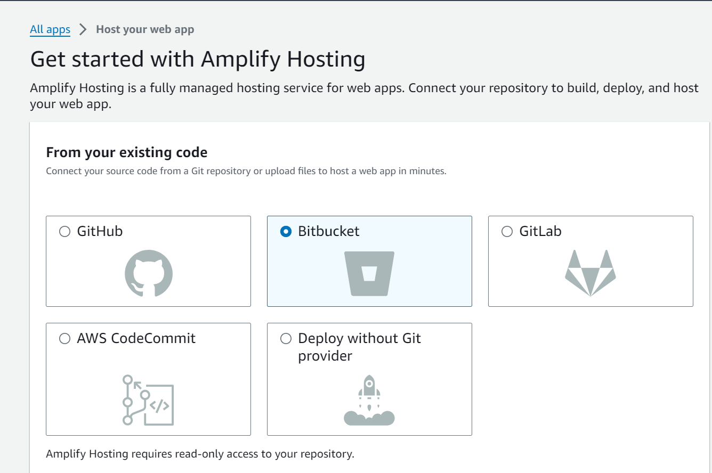

# Mock Speak Frontend - README #

This README provides a comprehensive guide to the technologies employed in this React project, along with resources and instructions for setting up the application locally. Additionally, it includes various use cases to help users navigate and understand the project.

### **Technologies Used** ###

- React: A JavaScript library for building user interfaces (<https://react.dev/>). We have utilized various libraries of React to render the components and implement various functionalities:
  - ui-react, user-event, aws-amplify, bootstrap, cors, react-datepicker, react-dom, react-dreaggable, react-loader-spinner, react-router-dom, react-scripts react-speech-recognition web-vitals.
- We have Utilized AWS Cognito for user Autherization and Authentication. (<https://docs.aws.amazon.com/cognito/latest/developerguide/what-is-amazon-cognito.html>)
- Database we used is AWS-RDS-PostGres
- Backend Springboot Monolithic

### **How do I get set up?** ###

#### **Clone the Repository and setup** ####

- Clone the repository from **master** branch into the local directory.

#### **Configuration** ####

- Open the folder in the Visula Studio. (If not available, download at: <https://code.visualstudio.com/>)
- Add the necessary Dependencies.

#### **Dependencies** #####

- **npm install**

#### **How to run tests** ####

- In the terminal, run **npm start** and you will the

#### Deployment instructions ####

- Step 1: Push the code to any Version control repository like Git, Bitbucket, AWS CodeCommit..etc.

-  Step 2: Go to the AWS Amplify and click on New app then Host web app. Ref: <<https://us-east-2.console.aws.amazon.com/amplify/home>
-  
- Step 3: Select the version control where the repo is avaiable (CHoose the one you used in Step 1) and then click on connect.

- Step 4: Select the appropriate repository and branch.
- Step 5: Give you Web-app name. Let say "mock-speak"
- Step 6: Go to next and click on **save and deploy**
- Step 7: Get the end url once the build/deployment is completed.
